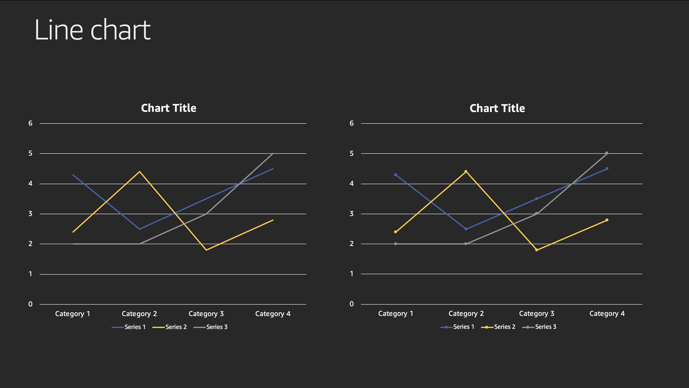

+++
title = "Lambda On Java Workshop"
weight = 1
+++

# Welcome Builders!

## Why are we here?

Customer want to leverage the advantages of Serverless architectures...

Customers who are running their AWS Lambda functions on Java are constantly struggeling with the the so called "function cold-start". The function cold start is the time the AWS Lambda services needs to provisioning and start the underlying runtime environment. ...

Mention Spring...

This workshop is composed of 3 parts. In the first part, 

## Our imaginary service

Introduce into the service architecture

## How did we measure the performance

bla bla

## The performance of these service

Gatling
starting with 1 user and ramping up to 20 concurrent user over 60 seconds, resulting in 630 service invocations in 1 minute.

Also running 10 cold and warm invocations to determine the best performance for it.

## Your current experience by migration Java based services to AWS Lambda

+ **What are your measurements in terms of increased/decreased performance and throughput?**
  + **What performance would you expect for this imaginary service?**
  + **Do you consider P50, P75, P90, P95, P98, P99 or P100 metrics**
+ **What are your observations in terms of scalability?**
