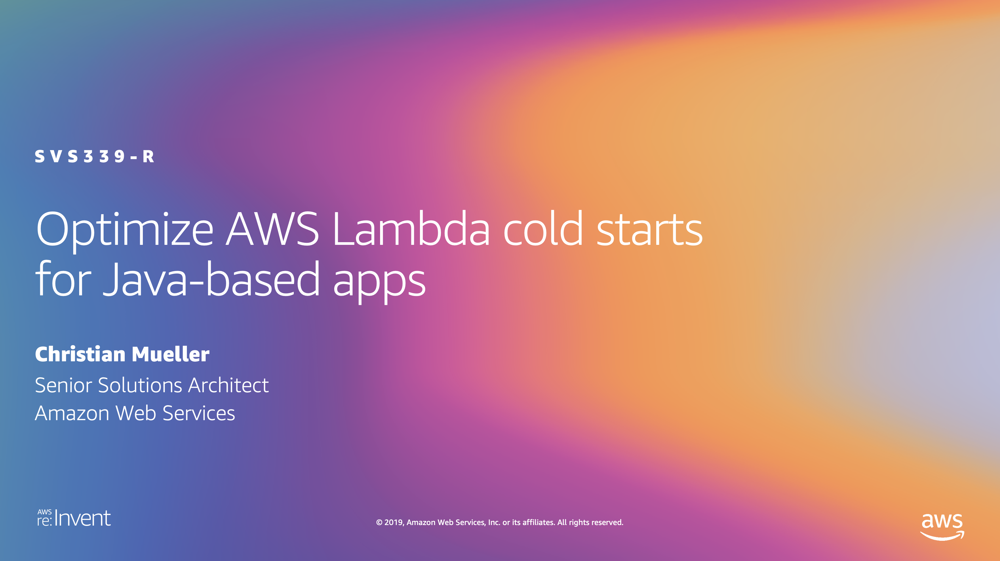
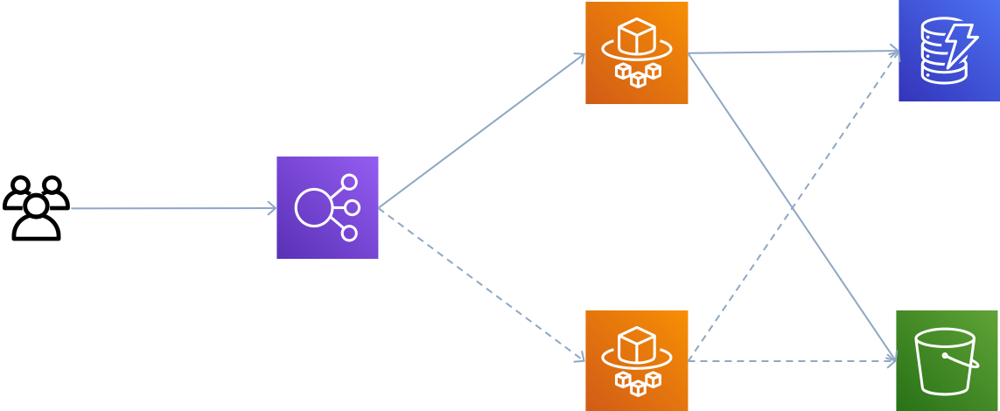
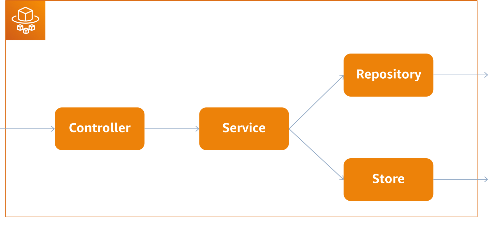

+++
title = "Lambda On Java Workshop"
weight = 1
+++

## Welcome Builders!

### Why are we here?

Customers who are running their AWS Lambda functions on Java are constantly struggling with the the so called "function cold-start". The function cold start is the time the AWS Lambda services needs to provisioning and start the underlying runtime environment, when it's called the first time or when the concurrent execution increases.

In this session I will share with you, how you can optimizations your Java based AWS Lambda functions, so that you will see a shorter cold-starts and a higher P99 performance.

This workshop is composed of 3 parts:  
In the first part, we will measure the performance baseline, based on a service implementation running in AWS Fargate behind an Application load balancer. As a second baseline, we will measure the performance of a service implementation in Python. After that, we will see how we can significantly improve the performance by moving away from Springboot.  
In the second part, we will have a look at many approaches, how we could improve the performance of our service. Some are more successful then others, and when we combine all of them, we see another remarkable performance improvement.  
Last but not least, we will have a look at GraalVM, a polyglot virtual machine which come with the capability to compile your Java code to native-code. Let's see whether and how this can help us to reduce the latency even further.  

### Our imaginary service

This is the high-level architecture of our current service implementation. Behind an Application Load Balancer, we are using 2 AWS Fargate container which hosts our Springboot application. This application stores pet data in Amazon DynamoDB and the medical record for each pet in Amazon S3.

If we have a closer look into our service implementation, we will see it's a typical Springboot application. Our controller takes the incoming requests and routes them based on path-matching to the corresponding service class, which contains our business logic. This service implementations uses a repository and a store as persistence layer, to store the pets and medical records.

